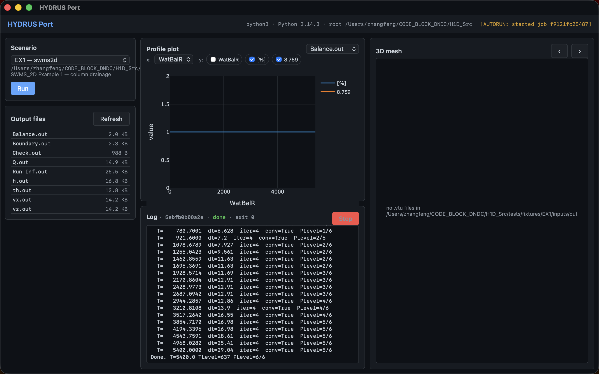
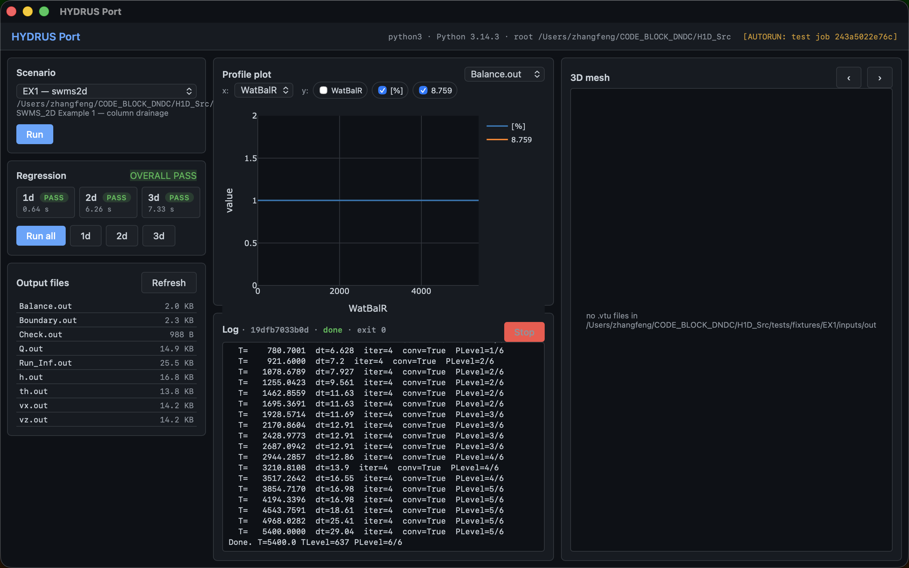

# hydrus-port

Python ports of **HYDRUS-1D** and **SWMS_2D** (Šimůnek et al., USDA-ARS USSL)
plus a from-scratch **3D Richards** extension on scikit-fem, all behind a
single `hydrus` CLI and an optional Tauri desktop GUI.



## What's in here

| Package | What it is |
|---|---|
| `hydrus1d/` | 1:1 port of HYDRUS-1D 4.08/7.0 Fortran (Richards + heat + solute) |
| `swms2d/` | 1:1 port of SWMS_2D v1.22 — see [swms2d/README.md](swms2d/README.md) for the port log + verification status |
| `swms2d/richards3d.py` | 3D Richards solver on scikit-fem (MeshTet / MeshHex, row-sum mass lumping) |
| `hydrus_port/` | The unified `hydrus` CLI |
| `hydrus_port_server/` | FastAPI sidecar (REST backend used by the GUI; runnable standalone) |
| `desktop/` | Tauri 2 + Vue 3 desktop GUI |

## Install

```bash
pip install -e .                  # core: hydrus1d + swms2d + 3d + hydrus CLI
pip install -e '.[fem3d]'         # + scikit-fem + meshio (needed for `hydrus 3d`)
pip install -e '.[viz]'           # + matplotlib + pyvista
pip install -e '.[gui]'           # + fastapi + uvicorn + pydantic (server)
pip install -e '.[dev]'           # + pytest + hatchling
```

## Unified CLI

```
hydrus 1d   <input_dir> [-o OUT]              # HYDRUS-1D
hydrus 2d   <input_dir> [-o OUT] [...]        # SWMS_2D
hydrus 3d   [<input_dir>] [-o OUT]            # 3D Richards (no args → demo)
hydrus test [1d|2d|3d|all]                    # smoke-test one or all paths
```

`-o` defaults to `<input_dir>/out`. Each subcommand only exposes the
flags the underlying solver understands (e.g. `--vtk`, `--anderson`,
`--banded` for 2d). Run `hydrus <kind> --help` for details.

### Examples

```bash
# 1D — HYDRUS-1D fixture
hydrus 1d tests/fixtures/soil_loam_infiltr/inputs

# 2D — SWMS_2D EX.1 column drainage
hydrus 2d tests/fixtures/EX1/inputs -o /tmp/ex1

# 2D — EX.2 dry-spell with VTK output for ParaView
hydrus 2d tests/fixtures/EX2/inputs --vtk -o /tmp/ex2

# 3D — synthetic infiltration on a tensor-product box (validation demo)
hydrus 3d
```

### Tests

`hydrus test` runs a representative fixture for each kind, reports
wall time and the key result metric, and exits non-zero on failure.

```bash
hydrus test          # all three (1d + 2d + 3d)
hydrus test 1d       # just one
```

Actual output from the most recent run on this checkout:

```
=== hydrus test 1d ===
  input: tests/fixtures/soil_loam_infiltr/inputs
[PASS] 1d
  files (6): BALANCE.OUT, CumFlux.out, MassBal.out, NOD_INF.OUT, T_LEVEL.OUT, Time.out
  wall_s: 0.642
  sim_t: 2.0

=== hydrus test 2d ===
  input: tests/fixtures/EX1/inputs
[PASS] 2d
  files (9): Balance.out, Boundary.out, Check.out, Q.out, Run_Inf.out,
             h.out, th.out, vx.out, vz.out
  Volume_last: Volume  [V]         1.462e+01  1.462e+01
  WatBalT_last: WatBalT [V]        -7.983e-01
  WatBalR_last: WatBalR [%]             8.759
  wall_s: 6.231

=== hydrus test 3d ===
  Tet/Hex × lumped/consistent cross-validation
[PASS] 3d
  tetra_lump_vs_consistent_max_dh_cm: 5.775
  hex_lump_vs_consistent_max_dh_cm:   4.691
  tetra_vs_hex_lump_max_dh_cm:        0.962
  wall_s: 7.243

========================================
OVERALL: PASS
```

What each metric means:

- **1d** — `sim_t` is the final simulated time. Pass criterion: the
  three canonical files (BALANCE / NOD_INF / T_LEVEL) all written.
- **2d** — `WatBalR` is the **relative water-balance error** in
  percent. EX.1 has a known O(few %) residual due to coarse default
  output cadence — fine for smoke-testing; see
  [`swms2d/README.md`](swms2d/README.md) for the Fortran-vs-Python
  parity story.
- **3d** — `*_max_dh_cm` is the worst-case nodal head disagreement
  between two solver variants on a thin-column infiltration. Threshold
  is 20 cm; lumped vs consistent ~5 cm difference is the expected
  effect of row-sum lumping (more diffusive, sharper-front-friendly).

## Built-in fixtures

```
tests/fixtures/EX1..EX4/inputs/        SWMS_2D 1.22 canonical examples
tests/fixtures/soil_*/inputs/          HYDRUS-1D scenarios (loam infiltration,
                                       sand drainage, layered profiles, …)
tests/fixtures/scenario_3d_{water,chem}/  Larger HYDRUS-1D field scenarios
```

## Desktop GUI

```bash
cd desktop && npm install            # one-time
npm run tauri:dev                    # dev: HMR + Tauri window
npm run tauri:build                  # release: .app / .dmg
```

The GUI lists every fixture under `tests/fixtures/`, runs `hydrus
<kind> <path>` as a subprocess, streams stdout to a live log panel,
lists output files as they appear, plots any numeric `.OUT` / `.out`
file (Plotly), and renders any `.vtu` written by the 3D solver
(Three.js + inline VTU ASCII parser, time-slider over the series).

A **Regression** panel on the left exposes the same `hydrus test`
gate as a one-click button: streaming PASS/RUNNING/— per kind with
wall-clock timing, plus an `OVERALL PASS / FAIL` badge.



The Rust side never touches Python directly — it just spawns the
unified `hydrus` CLI and forwards events. That way the CLI stays the
single source of truth for how simulations are launched.

### Headless E2E mode

Set `VITE_AUTORUN=<scenario-name-substring>` (or put it in
`desktop/.env.development`) to make the GUI auto-pick that scenario
and fire Run on mount. Useful for smoke tests / screenshots.

## REST backend (standalone)

```bash
hydrus-port-serve --port 8765
```

Exposes the same simulators over HTTP — useful if you want to drive
runs from a notebook, Slack bot, CI, etc., without the Tauri layer.

```
GET  /api/health
GET  /api/scenarios
POST /api/simulate/{1d|2d|3d}     body: {input_dir, output_dir?}
GET  /api/jobs[/{id}[/log]]
GET  /api/jobs/{id}/files/{name}
```

## Architecture (one diagram)

```
                    ┌──────────────────────┐
                    │  desktop/  (Tauri 2) │
                    │  Vue 3 webview       │
                    └──────────┬───────────┘
                               │ invoke()
                    ┌──────────▼───────────┐
                    │  src-tauri/  (Rust)  │
                    │  spawns subprocess   │
                    └──────────┬───────────┘
                               │ python -u -m hydrus_port.cli {1d|2d|3d}
   ┌────────────────────┐      │      ┌────────────────────────┐
   │ hydrus-port-serve  │──────┴──────│ hydrus  (console_script)│
   │  (FastAPI, optional)│            │    hydrus_port/cli.py   │
   └────────────────────┘             └────────────┬───────────┘
                                                   │
                          ┌────────────────────────┼────────────────────────┐
                          ▼                        ▼                        ▼
               ┌──────────────────┐    ┌──────────────────┐    ┌────────────────────────┐
               │   hydrus1d/      │    │   swms2d/        │    │  swms2d/richards3d.py  │
               │   (1:1 Fortran)  │    │   (1:1 Fortran)  │    │  (scikit-fem 3D)       │
               └──────────────────┘    └──────────────────┘    └────────────────────────┘
```

The arrows below `hydrus` are plain Python imports. The CLI is thin
on purpose — every callable lives in the simulator packages where it
can be unit-tested and reused programmatically.

## Verification status

Quick gate: `hydrus test all` — see the [Tests](#tests) section above
for the actual current output.

Deeper status per layer:

- **HYDRUS-1D**: 13/13 IO modules + watflow + solute + heat ported and
  bit-equal on the test fixtures.
- **SWMS_2D**: EX.1 and EX.3 bit-equal vs the local gfortran build;
  EX.2 / EX.4 within Fortran's own mass-balance error. Details and
  the REAL\*4 vs float64 root cause in [`swms2d/README.md`](swms2d/README.md).
- **3D**: cross-validated MeshTet × MeshHex × {row-sum lumped,
  consistent} on a thin-column infiltration; lumped vs consistent
  diverges by ≤6 cm on the wetting front (expected — lumping is more
  diffusive), Tet vs Hex ≤1 cm with the same lumping.
- **CLI + GUI**: smoke-tested end-to-end; the GUI screenshots above
  come from `VITE_AUTORUN=EX1 npm run tauri:dev`.

## License

CC0-1.0 (matching SWMS_2D's U.S. Public Domain status).
